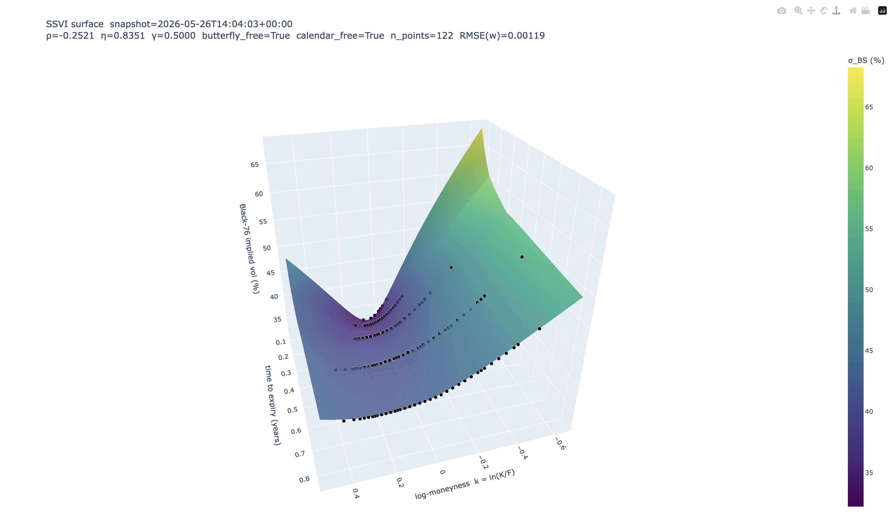

# Crypto Vol Surface

A live, arbitrage-free implied-volatility surface for Bitcoin options on Deribit. Ingests the full BTC chain (currently ~880 instruments across ~11 expiries per snapshot) every 5 minutes into TimescaleDB, solves implied vol from each quote with an inverse-contract-aware Black-76, jointly fits an arbitrage-free SSVI surface across expiries, and produces an interactive 3D surface plot. Validated against Deribit's own published `mark_iv` to within **0.05 vol points** on every liquid strike (project target: 0.1).

<p align="center">
  
</p>

## What it does

```
Deribit REST (every 5 min)
        │
        ▼
TimescaleDB  ──►  Black-76 IV solver  ──►  per-expiry SVI smile  ──►  joint SSVI surface
   raw quotes        spot-referenced              backbone θ_T               (ρ, η, γ)
                     zero-rate, F from              from ATM fit               + no-arb checks
                     dated future                                              + 3D Plotly render
```

The ingester writes raw observations once and never modifies them. Everything downstream is a pure function of stored data — replayable, testable, version-tagged.

## The hard parts (why this isn't just Black–Scholes on an API)

- **No risk-free rate in crypto.** Black–Scholes assumes you can fund a hedge at some `r`; there is no SOFR for BTC. The pricer instead uses Black-76 with the **forward `F` taken directly from Deribit's matching dated future**, and the discount factor pinned at `DF = 1.0` to match Deribit's `interest_rate = 0` mark-IV convention. For unlisted tenors, perp funding accrual provides the implied carry (Weeks 3-4 work, deferred).

- **Inverse / coin-settled contracts.** A Deribit BTC option pays in BTC, not USD. The textbook `δ_BS = N(d₁)` is not the USD hedge ratio: a long position is *also* short a unit of BTC numeraire repricing against USD, and the correction is exactly **`δ_USD = δ_BS − C/S`** where `C` is the USD option value and `S` is the BTC index. Documented and unit-tested in `pricer/inverse.py` against three first-principles limits (deep-OTM convergence to `δ_BS`, deep-ITM call saturation at 0, deep-ITM put `|δ| > 1`).

- **Arbitrage enforced, not assumed.** A surface that isn't arb-free can produce greeks that look right and PnL that's wrong.
  - **Butterfly arb** is rejected by the **Gatheral–Durrleman `g(k) ≥ 0`** condition for single smiles and by SSVI's two **Lemma 4.2 inequalities** `θ·φ·(1+|ρ|) < 4`, `θ·φ²·(1+|ρ|) ≤ 4` as **hard SLSQP constraints during the joint fit** — the optimiser never leaves the feasible region.
  - **Calendar arb** is rejected by requiring a monotone ATM-variance backbone (`θ_T` non-decreasing in `T`) and a numerical no-smile-crossing check on a dense `k`-grid out to `|k| = 3`.

## Quickstart

Reproduces the 0.05-vol-point validation claim from a clean clone in under five minutes:

```bash
# 1. Bring up TimescaleDB (schema initialises automatically).
docker compose up -d

# 2. Install Python deps (Python 3.12+, uv).
uv sync

# 3. Capture a snapshot of the live Deribit BTC chain (or use the committed
#    fixture — both paths work).
uv run python -m volsurface.ingestion       # one 5-min cycle, then Ctrl-C

# 4. Run the validation harness against Deribit's own mark_iv.
uv run python scripts/validate_iv.py
# → max |error| on liquid subset: 0.0505 vol points (target: < 0.1)
# → histogram PNG + summary JSON written to tests/validation/

# 5. Fit the SSVI surface and render the 3D plot.
uv run python scripts/fit_surface.py
# → surface_<timestamp>.html (interactive) + .png (static) in tests/analytics/
```

Test suite:

```bash
uv run pytest               # 597 passing, 8 skipped (float-floor edge cases)
uv run mypy src/            # strict mode, 23 source files, 0 issues
uv run ruff check src/ tests/ scripts/
```

## Architecture

| Module          | Responsibility                                                                                 | Pure?          |
| --------------- | ---------------------------------------------------------------------------------------------- | -------------- |
| `ingestion/`    | Deribit REST poller (sole DB writer) + WebSocket subscriber (in-memory live state).            | No (I/O)       |
| `storage/`      | asyncpg pool, typed row dataclasses, idempotent bulk upserts. Only module allowed raw SQL.     | No (DB)        |
| `pricer/`       | Black-76 price + analytic Greeks, Newton+Brent IV solver, inverse-delta correction.            | **Yes**        |
| `calibration/`  | Single-smile SVI + Gatheral–Durrleman check. SSVI surface + both Gatheral–Jacquier inequalities. | **Yes**        |
| `validation/`   | Grades the pricer against Deribit's published `mark_iv`. Produces the error histogram.         | Orchestration  |
| `analytics/`    | Pulls stored data, calls pure modules, produces SVI smile plots and the SSVI 3D surface.       | Orchestration  |

The hard line: **`pricer/` and `calibration/` are numpy in, numpy out** — no DB, no logging, no I/O. The orchestration layers (`validation/`, `analytics/`) do the data plumbing. This isolates the numerics for fast testing and makes the model swappable.

The ingestion / analysis split mirrors the schema (`storage/schema.sql`): ingestion tables (`instruments`, `option_quotes`, `forwards`, `funding_rates`) are immutable raw observations; the analysis table (`computed_iv`) is versioned pricer output, regeneratable from raw data.

## Validation & results

**Pricer.** Validation harness checks our IV solver against Deribit's published `mark_iv` on every liquid strike (OI > 10, spread/mid < 5%) for a captured snapshot. On the committed 9-point OTM fixture spanning the 26JUN26 expiry:

```
max |error|   = 0.0505 vol points    (target: < 0.10)
mean |error|  = 0.0355 vol points
n_liquid      = 9 / 9 (all captured strikes pass the liquidity filter)
```

Error histogram: `tests/validation/error_histogram_v0.1.0.png`. A small consistent negative bias of ~−0.04 vp remains across the smile — likely a clock/timing offset between our snapshot moment and Deribit's `mark_iv` computation moment, or a minor time-to-expiry convention difference; not fully attributed. Inside the 0.1 budget.

**SSVI fit.** On the committed snapshot (full 11-expiry BTC chain, 878 quotes), the joint fit retains **5 expiries / 118 liquid OTM points** after the liquidity filter — fitted range ~1 month to ~10 months. Sub-week expiries are dropped automatically (see Methodology notes). The fit converges to:

| Parameter | Value      | Interpretation                                                                                          |
| --------- | ---------- | ------------------------------------------------------------------------------------------------------- |
| `ρ`       | **−0.25**  | Negative skew — OTM puts richer than equidistant OTM calls. Typical BTC tail-risk pricing.              |
| `η`       | **0.91**   | Overall smile amplitude. Combined with `γ`, sets how steep the wing slope decays with tenor.            |
| `γ`       | **0.50**   | Power-law decay of wing slope vs ATM variance. Pins at the Gatheral–Jacquier safe-range upper bound.    |

Both arb conditions pass — `butterfly_free = True` (Lemma 4.2 inequalities slack at every backbone θ), `calendar_free = True` (no smile crossings on `|k| ≤ 3`).

## Methodology notes & honest limitations

- **Sub-3-day expiries are excluded automatically.** They carry open interest but their wing strikes have near-zero time value, so a single tick on the bid or ask blows the relative spread past the 5% threshold and they fail the calibration filter. This is intentional — fitting a smile to sub-week microstructure noise produces unstable parameters. The filter is the CLAUDE.md-mandated `open_interest > 10 AND (best_ask − best_bid)/mark_price < 0.05`.

- **Calendar arbitrage is enforced by parameter restriction + post-hoc verification, NOT fully by construction.** Butterfly arb is excluded by hard SLSQP constraints during the fit; calendar requires `γ ∈ [0, 0.5]` (the Gatheral–Jacquier safe range), refuses non-monotone backbones in preprocessing, and verifies no smile crossings numerically after the fit. A calendar violation on the fitted surface is detectable but not impossible at intermediate iterations — the verification step is load-bearing.

- **Inverse delta is validated against first-principles limits, not Deribit's `ticker.delta`.** The REST ingester leaves `option_quotes.deribit_delta` `NULL` (book_summary doesn't carry greeks), so the `δ_USD = δ_BS − C/S` correction is tested against analytic limits (deep-OTM convergence, deep-ITM call saturation at 0, deep-ITM put `|δ| > 1`) rather than external ground truth. Closing that loop is on the roadmap.

- **`γ` pins at its upper bound 0.5.** A diagnostic run with the bound widened to 0.7 found the unconstrained optimum sits at `γ ≈ 0.51` — just past the Gatheral–Jacquier safe range. RMSE difference was ~1%, calendar still passed numerically. We keep the principled `γ ≤ 0.5` bound; the cost is small and the analytic calendar guarantee is preserved.

- **The 3D surface between fitted expiries is model-interpolated, not data.** Only the discrete backbone `θ_T` values come from per-expiry ATM fits; the mesh in between is the SSVI formula evaluated on a linearly-interpolated `θ`. The dots are real market observations; the mesh is model output. If the dots don't sit on the mesh, the fit is bad — not the dots.

## Roadmap

In progress / next slices, per `SCOPE.md`:

- **Tardis historical backfill** — 6 months of 5-minute snapshots, enabling realized-vs-implied vol series and PCA on daily surface changes.
- **FastAPI + Next.js dashboard** — public URL with live SSVI surface, term structure, and 25Δ risk-reversal / butterfly time series. WebSocket push from the existing in-memory book subscriber.
- **Dislocation analytics** — calendar-spread Z-scores, smile-vs-realized comparison, one published research note in `RESEARCH.md`.

Out of scope for v1 (the `v2` parking lot in `SCOPE.md`): ETH, cross-venue (OKX/Bybit), Heston/SABR, options backtesting, user accounts.
